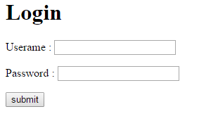
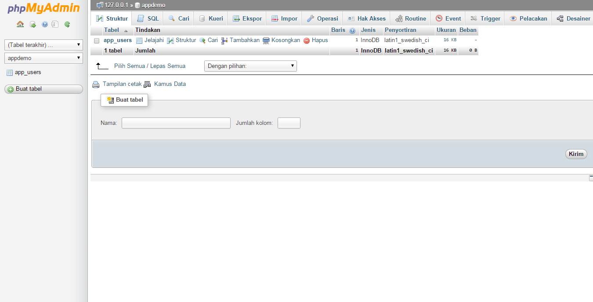

# create-login-page
Belajar dan berbagi pemrograman web - membuat halaman login dengan code library php dasar
-----------------------------------------------------------------------------------------
membuat halaman login menggunakan <a href="https://github.com/dwilanang/code-lib-php/archive/master.zip">library php</a> dasar untuk lebih mudah dan simple dalam menuliskan code.
file yang terdapat pada projek membuat halaman login :
- <a href="https://github.com/dwilanang/code-lib-php/archive/master.zip">library php</a>
- index.php
- login.html
- 

tahapan membuat halaman login :
- membuat database pada mysql melalui phpmyadmin - contohnya nama database "appdemo"
- 
- membuat table pada database yang telah dibuat - contohnya nama table "app_users"
- buka folder code-lib-php, buka file config untuk konfigurasi ke database seperti pada bagian <a href="https://github.com/dwilanang/code-lib-php">code-lib-php</a>
- <iframe width="300" height="300" src="https://www.youtube.com/embed/n7Y30hpV_AA" frameborder="0" allowfullscreen></iframe>
