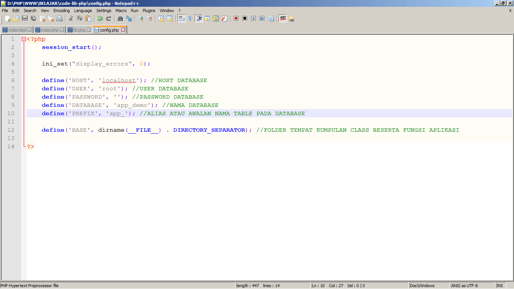

# code-lib-php
Belajar dan berbagi - Library dasar pemrograman web
----------------------------------------------------------------------------------------------------------------------
- cofig.php
- table.php
- init.php
- lib.php
- db.php

Langkah - langkah penggunaan :
- download <a href="https://github.com/dwilanang/code-lib-php/archive/master.zip">here</a>
- extract library ke dalam folder pada aplikasi website
- buka file config.php kemudian isikan variable untuk konek ke database - HOST | USER | PASSWORD | DATABASE | PREFIX
- 
- panggil file init.php melalui index.php atau file tempat library dibutuhkan
-  <pre>
    <?php
        include "code-lib-php/init.php";
    	$app = new lib;
    	$app->run();
    ?>
  </pre>
- setting nilai pada fungsi run menjadi 1 untuk mematikan pesan berhasil - $app->run(1) atau hapus pemanggilan fungsi
